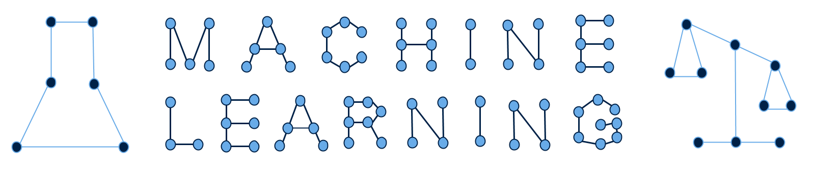

# Machine Learning for Science & Society

__Spring 2022__

__Professor Sarah Brown__

In this class we will address the challenges in applying machine learning to scientific research and in high stakes social contexts. On the science side, we will examine the role of ML in research, in particular how it works within knowledge production. On the social side, we will consider how to ensure ML-trained algorithms make fair decisions. While these two applications are distinct, many of the technical challenges are shared. Some of the common challenges include:
- missing data
- noisy or missing labels
- multiple objectives

We will look at a range of strategies for identifying and mitigating these problems including:
- robust evaluation
- model inspection,
- model explanations
- interpretable models.

[Request a permission number for CSC 592](https://forms.gle/XouLBRikos7J4Lpg7)

